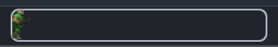
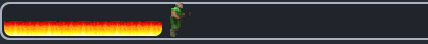

# DoomProgressBar

The Doom progress bar for IntelliJ IDEA and other JetBrains IDEs.

## Contributing

Contributions are very welcome on this project! Please see our [contributing guidelines](CONTRIBUTING.md) and [code of conduct](CODE_OF_CONDUCT.md) to get started.

## Acknowledgements

### Sprites
* All sprites belong to owners of the pictures.

### Code

* The code for the progress bar was adapted from [Mario Progess Bar](https://github.com/KikiManjaro/MarioProgressBar).
* The code for the progress bar was adapted from [Nyan Progess Bar](https://github.com/batya239/NyanProgressBar).
* This plugin is of course heavily dependent on JetBrains' IntelliJ SDK